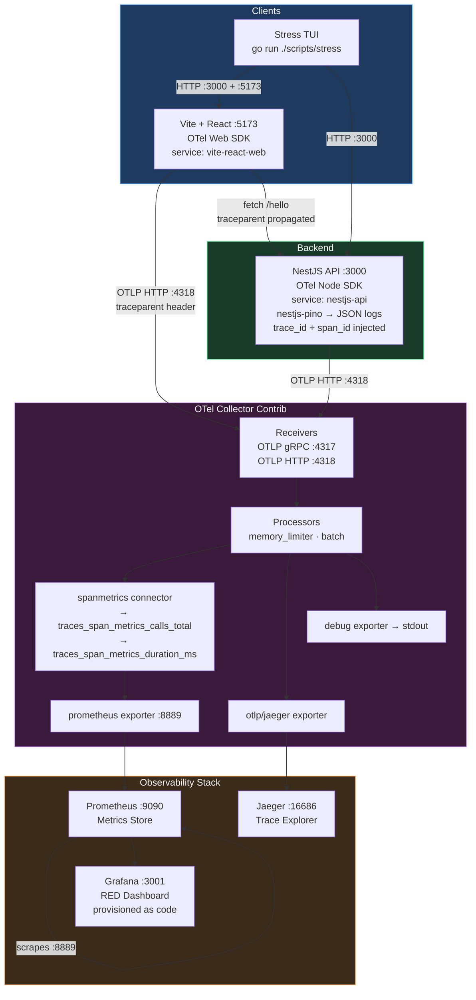

# OTel NestJS Monorepo

A production-grade observability reference implementation. Generates end-to-end distributed traces, correlated structured logs, and RED metrics (Rate / Errors / Duration) flowing from a React frontend through a NestJS API into a full OpenTelemetry stack — all in one `docker compose up`.

---

## Architecture



### Three Pillars implemented

| Pillar | How |
|---|---|
| **Distributed Tracing** | OTel Node SDK + Web SDK → Collector → Jaeger. `traceparent` header propagates browser → API. |
| **Correlated Logs** | `nestjs-pino` + `@opentelemetry/instrumentation-pino` auto-injects `trace_id` / `span_id` into every JSON log line. |
| **Metrics (RED)** | OTel Collector `spanmetrics` connector derives `calls_total` and `duration_milliseconds` from spans → Prometheus → Grafana dashboard. |

---

## Stack

| Layer | Technology |
|---|---|
| Monorepo | pnpm workspaces + Turborepo |
| Backend | NestJS 11, Node 20, TypeScript 5 |
| Frontend | Vite 8, React 19, TypeScript 6, Node 22 |
| Tracing | `@opentelemetry/sdk-node`, `@opentelemetry/sdk-trace-web` |
| Logging | `nestjs-pino` + `@opentelemetry/instrumentation-pino` |
| Collector | `otel/opentelemetry-collector-contrib` |
| Traces UI | Jaeger all-in-one |
| Metrics | Prometheus + Grafana (provisioned RED dashboard) |
| Containers | Docker Compose, multi-stage builds (nginx for web) |
| Stress tool | Go + Bubbletea TUI |

---

## Quick Start

### Prerequisites

- Docker (OrbStack or Docker Desktop)
- Node.js ≥ 20, pnpm
- Go ≥ 1.21 *(only for the stress tool)*

### 1 — Start the full stack

```bash
make up
```

This builds the API and web images and starts all 6 services. First run pulls ~500 MB of images.

### 2 — Verify services

| Service | URL |
|---|---|
| NestJS API | http://localhost:3000/hello |
| Web frontend | http://localhost:5173 |
| Grafana (RED dashboard) | http://localhost:3001 |
| Jaeger (trace explorer) | http://localhost:16686 |
| Prometheus | http://localhost:9090 |
| OTel Collector (gRPC) | localhost:4317 |
| OTel Collector (HTTP) | localhost:4318 |

Grafana opens with anonymous admin access — no login required.

### 3 — Generate traffic

Click **Fetch Backend (/hello)** in the web UI, or run the stress tool:

```bash
make stress              # 60 s, 10 workers, live TUI
make stress d=2m c=20    # 2 min, 20 workers
```

The stress tool hits `/hello` (200), `/notfound` (404 → drives error-rate panel), and the web app simultaneously.

### 4 — Explore

- **Grafana** → *NestJS API — RED Metrics* dashboard: request rate, error %, P50/P95/P99 latency
- **Jaeger** → search `nestjs-api` or `vite-react-web` to see distributed traces with custom span attributes
- **API logs** — every log line includes `trace_id` and `span_id`:

```bash
make logs   # or: docker compose logs api -f
```

```json
{
  "level": "info",
  "msg": "Handling GET /hello request",
  "trace_id": "2cc4c4dd85e384044035ddd260698b4b",
  "span_id": "e969c533ab3b8a0b"
}
```

---

## Development

### Install dependencies

```bash
pnpm install
```

### Local dev (no Docker)

```bash
make dev          # both apps in watch mode (Turbo)
make dev-api      # NestJS only
make dev-web      # Vite only
```

> The observability stack (Collector, Jaeger, Prometheus, Grafana) must still run via `make up` for traces and metrics to be collected.

### Build

```bash
make build        # compile all apps via Turbo
make build-api    # NestJS only
make build-web    # Vite only
make build-docker # Docker images only
```

### Test

```bash
make test                                    # all apps
cd apps/api && pnpm test                     # unit tests
cd apps/api && pnpm test:watch               # watch mode
cd apps/api && pnpm test:e2e                 # e2e
cd apps/api && pnpm test:cov                 # coverage
```

### Lint

```bash
make lint
```

---

## Project Structure

```
repo-root/
├── apps/
│   ├── api/                    # NestJS API
│   │   ├── src/
│   │   │   ├── tracer.ts       # OTel SDK init (must be first import in main.ts)
│   │   │   ├── main.ts         # Bootstrap — tracer started before NestJS
│   │   │   ├── app.module.ts   # LoggerModule (nestjs-pino)
│   │   │   └── app.controller.ts # GET /hello with custom span attributes
│   │   └── Dockerfile          # Multi-stage, node:20-alpine, USER node
│   └── web/                    # Vite + React frontend
│       ├── src/
│       │   ├── tracer.ts       # OTel Web SDK (fetch instrumentation)
│       │   └── App.tsx         # Fetch Backend button
│       └── Dockerfile          # Multi-stage, node:22-alpine → nginx:alpine
├── otel/
│   ├── otel-collector.yaml     # Receivers, spanmetrics connector, exporters
│   ├── prometheus.yml          # Scrapes collector :8889
│   └── grafana/
│       ├── provisioning/
│       │   ├── datasources/datasource.yaml   # Prometheus + Jaeger
│       │   └── dashboards/dashboard.yaml     # Provider config
│       └── dashboards/
│           └── nestjs-red-metrics.json       # Pre-built RED metrics dashboard
├── scripts/
│   └── stress/                 # Go + Bubbletea TUI load generator
│       ├── main.go
│       └── go.mod
├── docker-compose.yml
├── Makefile
├── turbo.json
└── pnpm-workspace.yaml
```

---

## OTel Collector Pipeline

```
traces pipeline:
  otlp → [memory_limiter, batch] → [debug, otlp/jaeger, spanmetrics]
                                                          │
metrics pipeline:                                         │
  [otlp, spanmetrics] → [memory_limiter, batch] → [debug, prometheus]
```

The `spanmetrics` connector is both a traces exporter and a metrics receiver. It produces:

- `calls_total{span_kind, service_name, http_method, http_route, http_status_code}` — counter
- `duration_milliseconds_bucket{...}` — histogram for P50/P95/P99 queries

---

## Stress Tool

Located in `scripts/stress/` — a self-contained Go module.

```bash
# From repo root
make stress d=5m c=30

# Or directly
cd scripts/stress
go run . -d 5m -c 30
go run . -h
```

**Flags:**

| Flag | Default | Description |
|---|---|---|
| `-d` | `60s` | Duration (Go duration string: `30s`, `2m`, `5m`) |
| `-c` | `10` | Concurrent workers |

The TUI shows a live progress bar, stat boxes (total / success / errors / avg latency), a scrolling request log, and direct links to Grafana and Jaeger.

---

## Docker Commands

```bash
make up       # build images + start all services (detached)
make down     # stop and remove containers + volumes
make logs     # follow all service logs
make ps       # show container status and ports
make restart  # down + up
make clean    # nuke node_modules, dist, .turbo, Docker volumes
```

---

## Key Design Decisions

**OTel SDK before NestJS bootstrap** — `tracer.ts` is the first import in `main.ts`. This ensures `@opentelemetry/instrumentation-pino` patches Pino before `nestjs-pino` creates its logger instance, so `trace_id`/`span_id` are injected automatically on every log line.

**spanmetrics connector for RED metrics** — No manual `prom-client` counters in the app. The OTel Collector derives Rate, Error, and Duration metrics directly from trace span data. This means the Prometheus metrics are always consistent with what Jaeger shows.

**nestjs-pino as the logger** — Fastest structured JSON logger for NestJS (Pino is 5–7× faster than Winston). OTel-native log correlation via `@opentelemetry/instrumentation-pino` (included in `getNodeAutoInstrumentations()`).

**Grafana provisioned as code** — Datasources and the RED dashboard are provisioned via YAML/JSON on startup. No manual Grafana setup needed.
